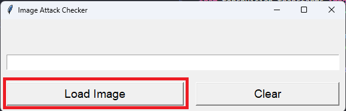
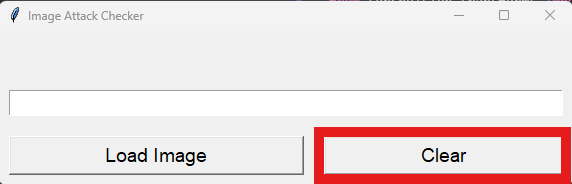
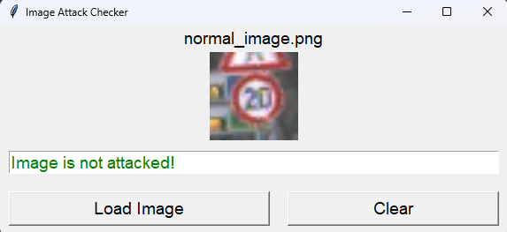

# This GUI application permits one to run our detection model on attacked and not attacked traffic signs images.

## The images can be either attacked using FGSM or PGD, some test **images** are offered inside the images folder

## To run this application you will need to:

- Install the requirements with: `pip install -r requirements.txt`
- Run the application with: `python main.py`

## The UI is simple and contains of multiple buttons and a text box to show the prediciton.

- The load button permits the loading of images and gives them to the model for analysis and also display it onto the interface.
  
- The clear button permits the clearing the current image and revertin back to the initial state.
  
- The user interface after the model made the prediction will be shown inside the text box, with green for **not attacked**, and red for **attacked**.
  
